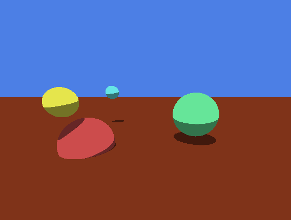
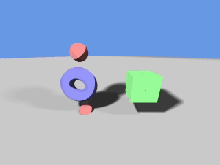
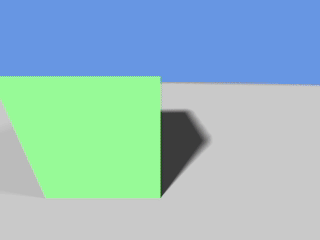

# Ray Marching & Ray Tracing
 
 
This repository contains my C++ implementation of ray marching and ray tracing.  Both shaders are written in GLSL and are my first foray into 3d graphics. Ray tracing and ray marching are both methods for rendering realistic 3D graphics based on the physics of real-world light.

## Ray Tracing

[Ray tracing](http://blog.three-eyed-games.com/2018/05/03/gpu-ray-tracing-in-unity-part-1/) works by sending out rays from the camera for each pixel. Rays travel in a direction away from the camera until intersecting with an object, where they can be reflected, refracted, or absorbed. Depending on how the ray interacts with the object more rays might be created or the color of the pixel might be updated. Ray tracing is an effective method for rendering highly realistic images. However, in my opinion it is significantly less interesting than Ray marching.

## Ray Marching
[Ray marching](https://iquilezles.org/www/articles/distfunctions/distfunctions.htm) also works by sending out rays from the camera for each pixel. However, instead of calculation intersections with objects, ray marching instead works by marching the ray along untill it its an object defined by a distance function. Because objects are represented by mathematical signed distance functions, you're able to do with objects anything that you'd with with functions. You can add them together, subtract one from another, and even lerp between them. Furthermore, one can use the modulo function to create mirrors which reflect the scene about an axis, allowing for the creation of fractle scenes with minimal computing. 

Ray marching is in my opinion much cooler than ray tracing. Here are some gifs demonstrating what I was able to do with a very basic understanding of the concept.

  
  
 

Ray marching can also be used to generate very high-quality 3d Renders and, due to its ability to warp space using modulo functions, can do so extremely effective. Using Monte Carlo approximations to solve for Lambert Diffusion and Phong specular reflections extremely realistic results can be achieved. Emissions can also be implemented fairly simply which allows for these stunning results.

  
  

